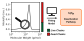

# polyterm: Polymer Termination Kinetics Analysis


A Python library for analyzing termination rates in fast-initiating polymerizations. Provides tools for generating molecular weight distributions from kinetic parameters and fitting experimental SEC/GPC data to determine termination kinetics.

<p align="center">
  
</p>

## System Requirements

### Hardware Requirements

This package is able to run on a modern (2025) laptop equipped with 16 GB of RAM. This package has not been tested on other hardware. No special hardware is required.

### Software Requirements

This package is supported on recent versions of Windows, MacOS, and Linux. It has been tested on the following operating systems.
- macOS Tahoe (26.5.2)
- Windows 11 (25H2)

The following dependencies are required:
- numpy
- scipy
- mpmath

## Installation

To install this package, use the following commands in your command line. You can also go directly to [the repository](https://github.com/taleff/polymer-term) and click on the green "< > Code" button to download a .zip file containing all the source code directly. Installation time is mainly bottlenecked by how fast you can download the package.

### From source

```bash
git clone https://github.com/taleff/polymer-term.git
cd polymer-term
pip install -e .
```

If you would like to run any of the tests or test modifications to the package, install the development dependencies.

### With development dependencies

```bash
pip install -e ".[dev]"
```

**For Advanced Users**

If you use Nix, navigate to the source directory and create a virtual environment as follows.

```bash
nix develop
pip install -e ".[dev]"
```

## Usage

Polyterm provides a number of functions useful for analyzing and generating molecular weight distributions. The following is a list of the primary functions that users can use, along with a link to a demonstration that provides basic usage examples.

- **[calculate_mwd](demos/calculate_mwd_example.md)** — Kinetic model dependent\
  Calculates a molecular weight distribution from kinetic parameters. Requires specifying the polymerization conditions (e.g. monomer concentration, initiator concentration) and kinetics (e.g. alpha values).

- **[calibrate_egh_broadening](demos/calculate_egh_broadening_example.md)** — Kinetic model agnostic\
  Fits an SEC trace with an exponential Gaussian hybrid curve. This allows the user to calibrate for the inherent line broadening present in SEC measurements.

- **[estimate_alpha](demos/estimate_alpha_example.md)** — Kinetic model dependent\
  Using a plot of peak molecular weight versus conversion, estimates the value of alpha, the ratio of the termination rate constant to the polymerization rate constant. Although the fitting procedure itself is kinetic model dependent, we encourage the community to plot M<sub>p</sub> versus conversion since its divergence from a linear relationship indicates chain death.

- **[estimate_death](demos/estimate_death_example.md)** — Kinetic model agnostic\
  Fits a Gaussian (or exponential Gaussian hybrid) to an SEC trace. This estimates the remaining amount of living chains left in the SEC sample.

- **[fit_mwd](demos/fit_mwd_example.md)** — Kinetic model dependent\
  Fits a measured SEC trace. The fitting tries to match a molecular weight distribution based on kinetics to the measured SEC trace, thereby determining the kinetic parameters of the polymerization.

Before running any of the examples, the following concepts are important to understand.

### SEC Line Broadening

Analysis of the molecular weight distribution is made more difficult by the inherent line broadening of SEC systems. Since the movement of a polymer chain through a column is a stochastic process, even a sample with a single molecular weight will exhibit a measurable line width. This library accounts for that by either applying line broadening when calculating the molecular weight distribution, or accounting for it when performing a fit. When fitting, the line broadening can be one of the fit parameters, but we highly recommend estimating it using a polystyrene calibration sample and using the "calibrate_egh_broadening" function to find the calibration value to be added as a parameter.

The library provides three ways to model line broadening: Gaussian, Exponentially Modified Gaussian<sup>[1](#ref1)</sup>, and Exponential Gaussian Hybrid<sup>[2](#ref2)</sup>. Our experience suggests that the exponential Gaussian hybrid model works best for our SEC instrument.

### kt/kp

Instead of providing the termination rate constant (kt), the functions instead work with the quantity alpha, defined as alpha=kt/kp. This is because the molecular weight distribution contains no absolute time information — the same distribution could result from a ten-second or ten-hour polymerization. This means we can only determine the ratio of termination rate to propagation rate (alpha) from the shape of the molecular weight distribution.

### Termination Kinetics

We have found that different polymerizations undergo different termination mechanisms. Depending on the chemistry, different or multiple pathways may be dominant. To cover the different cases we studied, some of the functions take a kinetics parameter that determines which kinetic model to use. The already written models are located in [polyterm/kinetics](polyterm/kinetics).

### Units

The library is unit agnostic. This means any units can be provided, but they MUST be consistent. For example, if monomer molecular weight is provided in g/mol, the molecular weights of the SEC trace must also be g/mol. This applies to kinetic quantities as well.

## Acknowledgments

This library was ideated by Professor Damien Guironnet and Michael Taleff. The library was written by Michael Taleff with the assistance of Claude Code. We would also like to thank Professor Simon Harrisson for helpful discussions on controlled radical polymerizations.

## Citing This Work

If you use polyterm in your research, please cite our paper (currently under review):

> Taleff, M.; Guironnet, D. Determining the Precision of Living Polymerizations via the Molecular Weight Distribution. *Manuscript in preparation*.

This section will be updated with the full citation and DOI upon publication.

## References

<a id="ref1"></a>1. Vega, J. R.; Schnöll-Bitai, I. Alternative Approaches for the Estimation of the Band Broadening Parameters in Single-Detection Size Exclusion Chromatography. *J. Chromatogr. A* **2005**, *1095*, 102–112. DOI: [10.1016/j.chroma.2005.08.003](https://doi.org/10.1016/j.chroma.2005.08.003)

<a id="ref2"></a>2. Lan, K.; Jorgenson, J. W. A Hybrid of Exponential and Gaussian Functions as a Simple Model of Asymmetric Chromatographic Peaks. *J. Chromatogr. A* **2001**, *915*, 1–13. DOI: [10.1016/S0021-9673(01)00594-5](https://doi.org/10.1016/S0021-9673(01)00594-5)
