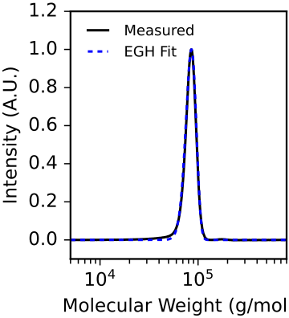

# Calibrating SEC Line Broadening

This tutorial demonstrates how to calibrate the instrumental line broadening of a size exclusion chromatography (SEC) system using `calibrate_egh_broadening`. The fitted broadening parameters (`sigma` and `tau`) can be used as inputs to other functions within the library.

**Full script:** [example_scripts/calibrate_egh_broadening_example.py](example_scripts/calibrate_egh_broadening_example.py)\
**Expected runtime:** ~10 seconds

## Data

This example uses a ~90 kDa polystyrene standard from Pressure Chemical, measured on a Tosoh Ecosec HLC-8320GPC. The data is in [example_data/polystyrene_standard_90kda.csv](example_data/polystyrene_standard_90kda.csv).

## Step 1: Load the SEC trace

```python
from data_import import load_gpc_trace

DATA_FILE = '../example_data/polystyrene_standard_90kda.csv'
CAL_FILE = '../example_data/calibrations.json'
CAL_NAME = 'ri_2025_11_21'

mws, ints = load_gpc_trace(
    DATA_FILE, CAL_FILE, CAL_NAME,
    bounds=(5e3, 8e5)
)
```

## Step 2: Calibrate broadening

For a high degree of polymerization polystyrene standard, the intrinsic Poisson chain length distribution is negligibly narrow compared to the instrumental broadening. According to Flory's result, the expected dispersity is only approximately 1.001 (much smaller than the measured dispersity). Here we measure that effect.

```python
result_poisson = calibrate_egh_broadening(mws, ints, monomer_mw=104.15)
```

## Step 3: Visualize the fit

```python
from polyterm import compute_poisson_broadened_mwd

ps_monomer_mw = 104.15  # g/mol (styrene)

broadened = compute_poisson_broadened_mwd(
    mws, result_poisson.center / ps_monomer_mw,
    ps_monomer_mw, result_poisson.sigma, result_poisson.tau
)

ax.plot(mws, ints / np.max(ints), 'k-', label='Measured')
ax.plot(mws, broadened / np.max(broadened), 'b--', label='EGH Fit')
```



## Using the results

The fitted `sigma` and `tau` values should be passed to `fit_mwd` and `estimate_death` to fix the broadening parameters during kinetic fitting:

```python
result = fit_mwd(
    mws, ints, order=1.0, monomer_mw=100.0,
    init_mon=1.0, sigma=0.128, tau=0.0456
)
```
