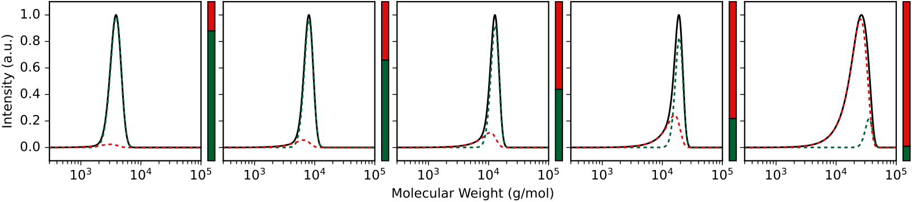

# Calculating Theoretical Molecular Weight Distributions

This tutorial demonstrates how to use `calculate_mwd` to generate theoretical molecular weight distributions for a fast-initiating polymerization with termination.

**Full script:** [example_scripts/calculate_mwd_example.py](example_scripts/calculate_mwd_example.py)

## Background

The shape of a molecular weight distribution encodes information about the termination kinetics of a polymerization. As chains terminate, they stop growing and accumulate as a low-MW tail. The `calculate_mwd` function computes the theoretical MWD given kinetic parameters.

## Step 1: Define kinetic parameters

```python
import numpy as np

monomer_mw = 100.0      # g/mol
init_mon = 1.0           # M (initial monomer concentration)
init = 1.0 / 200         # M (initiator concentration for DP 200)
alpha = 1.0 / 500        # kt/kp ratio (Rp/Rt = 500)
order = 1.0              # first order termination
sigma = 0.128            # SEC broadening parameter
tau = 0.0456             # SEC tailing parameter
```

The key parameter is `alpha` (kt/kp), which determines how much termination occurs. A smaller alpha means a more living polymerization.

## Step 2: Calculate the MWD

```python
from polyterm import calculate_mwd

mws = np.logspace(2, 5, 1000)

result = calculate_mwd(
    mws, monomer_mw, init_mon, alpha,
    init, conversion=0.6, order=order, sigma=sigma, tau=tau
)
```

The returned `MWDResult` object contains:
- `result.intensities` — total MWD (living + dead)
- `result.live_chain_intensities` — living chain contribution
- `result.dead_chain_intensities` — dead chain contribution
- `result.dead_chain_fraction` — fraction of chains that have terminated

## Step 3: Visualize the evolution with conversion

```python
max_conv = 1 - np.exp(-init / alpha)
fractions = [0.20, 0.40, 0.60, 0.80, 0.99]
conversions = [f * max_conv for f in fractions]

for conv in conversions:
    result = calculate_mwd(
        mws, monomer_mw, init_mon, alpha,
        init, conv, order, sigma, tau
    )

    norm = np.max(result.intensities)
    ax.plot(mws, result.intensities / norm, '-', color='black')
    ax.plot(mws, result.live_chain_intensities / norm, '--', color='#006230')
    ax.plot(mws, result.dead_chain_intensities / norm, '--', color='#DC0F0F')
```

As conversion increases:
- The living chain peak (green) shifts to higher MW and decreases in intensity
- The dead chain tail (red) grows as more chains terminate
- The total distribution develops an increasingly asymmetric shape with visible tailing


