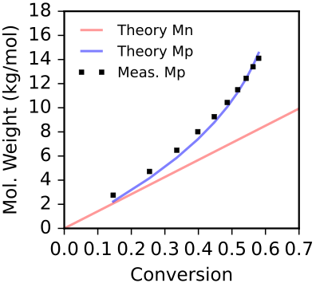

# Estimating Alpha from Peak Molecular Weight vs Conversion

This tutorial demonstrates how to use `estimate_alpha` to determine the termination rate ratio (kt/kp) from the evolution of the peak molecular weight with conversion.

**Full script:** [example_scripts/estimate_alpha_example.py](example_scripts/estimate_alpha_example.py)

## Data

This example uses the same timed aliquots as the [estimate_death example](estimate_death_example.md): anionic polymerization of styrene with continuous quenching at 2 min intervals. The data is in [example_data/anionic_styrene_timed_aliquots.csv](example_data/anionic_styrene_timed_aliquots.csv).

## Step 1: Extract peak molecular weights

```python
from data_import import load_all_traces, peak_molecular_weight

traces = load_all_traces(
    '../example_data/anionic_styrene_timed_aliquots.csv',
    '../example_data/calibrations.json',
    'ri_2025_11_21',
    bounds=(5e2, 1e5)
)

peaks = np.array([
    peak_molecular_weight(mws, ints) for mws, ints in traces
])
```

## Step 2: Calculate conversions

```python
from polyterm import monomer_conversion

init_mon = 1.00   # M
init = 0.00734    # M
kp = 11.6         # L/mol/min
kt = 0.0773       # 1/min

times = np.arange(2, 21, 2)
convs = 1 - monomer_conversion(times, kp, kt, init_mon, init, order=1.0)
```

## Step 3: Estimate alpha

```python
from polyterm import estimate_alpha

result = estimate_alpha(
    convs, peaks, monomer_mw, init_mon, init, order=1.0
)

print(f'Estimated alpha: {result["alpha"]:.5f} M')
print(f'R-squared:       {result["r_squared"]:.4f}')
```

## Step 4: Visualize

```python
pred_mn = monomer_mw * (init_mon / init)  # theoretical Mn (no termination)

ax.plot([0, 1], [0, pred_mn / 1000], 'r-', alpha=0.4,
        label='Theory Mn')
ax.plot(convs, result['predicted_mns'] / 1000, 'b-', alpha=0.5,
        label=f'Theory Mp')
ax.plot(convs, peaks / 1000, 'ks', markersize=6,
        label='Meas. Mp')
```



Note that we assume Mp is a good proxy for the living chain Mn, which becomes less accurate at high conversions where the living and dead peaks overlap significantly
