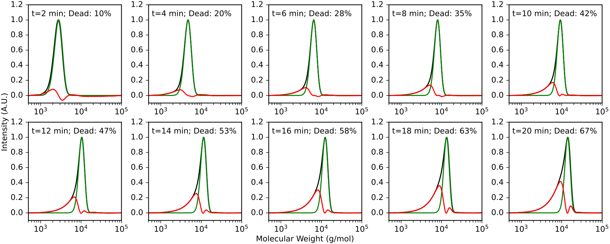
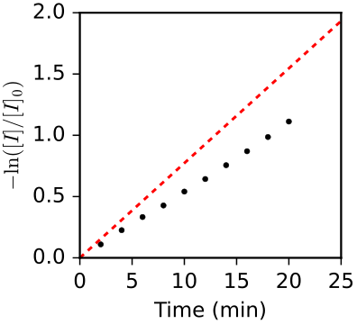

# Estimating the Dead Chain Fraction

This tutorial demonstrates how to use `estimate_death` to determine the fraction of dead chains in a polymer sample.

**Full script:** [example_scripts/estimate_death_example.py](example_scripts/estimate_death_example.py)

## Data

This example uses 10 timed aliquots from an anionic polymerization of styrene that was continuously quenched with 1-octanol. Aliquots were taken every 2 minutes from t=2 to t=20 min. The data is in [example_data/anionic_styrene_timed_aliquots.csv](example_data/anionic_styrene_timed_aliquots.csv).

## Step 1: Load the SEC traces

```python
from data_import import load_all_traces

traces = load_all_traces(
    '../example_data/anionic_styrene_timed_aliquots.csv',
    '../example_data/calibrations.json',
    'ri_2025_11_21',
    bounds=(5e2, 1e5)
)
```

## Step 2: Estimate dead fraction for each aliquot

```python
from polyterm import estimate_death

sigma = 0.128
tau = 0.0456
monomer_mw = 104.15  # g/mol (styrene)

for mws, ints in traces:
    result = estimate_death(
        mws, ints, sigma=sigma, tau=tau, monomer_mw=monomer_mw
    )
    print(f'Dead fraction: {result.dead_chain_fraction:.1%}')
```

The function returns an `MWDResult` with the decomposition into living and dead chain intensities, which can be plotted directly.

## With and without monomer_mw

The `monomer_mw` parameter controls the fitting mode:

- **With `monomer_mw`**: Uses a Poisson distribution convolved with EGH broadening. More accurate at low DP where the Poisson width is comparable to instrumental broadening.
- **Without `monomer_mw`**: Fits a simple EGH peak. Faster and suitable when Poisson broadening is negligible (high DP).

```python
# Poisson-corrected (recommended)
result = estimate_death(mws, ints, sigma=0.128, tau=0.0456, monomer_mw=104.15)

# Simple EGH (no monomer_mw needed)
result = estimate_death(mws, ints, sigma=0.128, tau=0.0456)
```

## Step 3: Verify with kinetics

For first order termination, the relationship -ln([I]/[I]_0) = kt * t should be linear. Plotting -ln(1 - dead_fraction) against time provides a check:

```python
times = np.arange(2, 21, 2)
ax.plot(times, -np.log(1 - dead_fracs), 'k.', markersize=12)
kt = 0.0773  # 1/min
ax.plot([0, 25], [0, 25 * kt], 'r--', label=f'Theory (kt={kt})')
```





This method underestimates the true dead chain fraction because dead chains whose molecular weight falls within the living chain peak cannot be resolved. The underestimate is small when the dead fraction is low, but becomes significant above ~50% dead chains.
