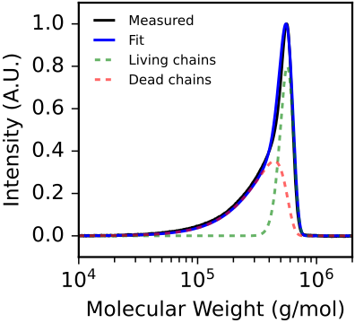

# Fitting a Kinetic Model to an Experimental MWD

This tutorial demonstrates how to use `fit_mwd` to determine the termination kinetics of a polymerization from its SEC trace. It uses data from the group transfer polymerization (GTP) of methyl methacrylate (MMA) at a target DP of 500.

**Full script:** [example_scripts/fit_mwd_example.py](example_scripts/fit_mwd_example.py)\
**Expected runtime:** ~4 minutes

## Data

This example uses the GTP of MMA at target DP 500. The GPC was calibrated with polystyrene standards, so Mark-Houwink parameters are used to calculate the effective monomer molecular weight on the PS-equivalent scale. The data is in [example_data/gtp_mma_dp300_dp400_dp500.csv](example_data/gtp_mma_dp300_dp400_dp500.csv).

## Step 1: Load the SEC trace

```python
from data_import import load_gpc_trace

mws, ints = load_gpc_trace(
    '../example_data/gtp_mma_dp300_dp400_dp500.csv',
    '../example_data/calibrations.json',
    'ri_2025_11_21',
    bounds=(1e4, 2e6),
    trace_index=2  # DP 500 sample
)
```

## Step 2: Set up parameters

```python
# Mark-Houwink conversion for PS-calibrated GPC
ps_k, ps_a = 0.00151, 0.706
pmma_k, pmma_a = 0.00122, 0.690
monomer_mw = ((pmma_k * 100.15 ** (1 + pmma_a)) / ps_k) ** (1 / (1 + ps_a))

init_mon = 1.0  # M
order = 1.0     # first order termination for GTP

# Broadening from calibration (see calibrate_egh example)
sigma = 0.128
tau = 0.0456
```

## Step 3: Fit the MWD

```python
from polyterm import fit_mwd

result = fit_mwd(
    mws, ints, order, monomer_mw, init_mon,
    sigma=sigma, tau=tau
)

print(f'Alpha (kt/kp): {result.alpha:.4e}')
print(f'Dead fraction:  {result.dead_chain_fraction:.1%}')
print(f'R-squared:      {result.r_squared:.4f}')
```

## Fixing vs fitting parameters

By default, `fit_mwd` fits alpha, initiator concentration, conversion, and (optionally) broadening. You can fix parameters you know:

```python
# Fix broadening (recommended if calibrated)
result = fit_mwd(mws, ints, order, monomer_mw, init_mon,
                 sigma=0.128, tau=0.0456)

# Fix conversion (e.g., for a fully quenched sample)
result = fit_mwd(mws, ints, order, monomer_mw, init_mon,
                 sigma=0.128, tau=0.0456, conversion=1.0)

# Fix initiator concentration
result = fit_mwd(mws, ints, order, monomer_mw, init_mon,
                 sigma=0.128, tau=0.0456, init=0.002)
```

Fixing more parameters reduces the degrees of freedom and generally improves fit reliability.

## Step 4: Visualize the fit

```python
norm_data = np.max(ints)
norm_fit = np.max(result.intensities)

ax.plot(mws, ints / norm_data, 'k-', label='Measured')
ax.plot(result.molecular_weights,
        result.intensities / norm_fit,
        'b-', label='Fit')
ax.plot(result.molecular_weights,
        result.live_chain_intensities / norm_fit,
        'g--', alpha=0.6, label='Living chains')
ax.plot(result.molecular_weights,
        result.dead_chain_intensities / norm_fit,
        'r--', alpha=0.6, label='Dead chains')
```


